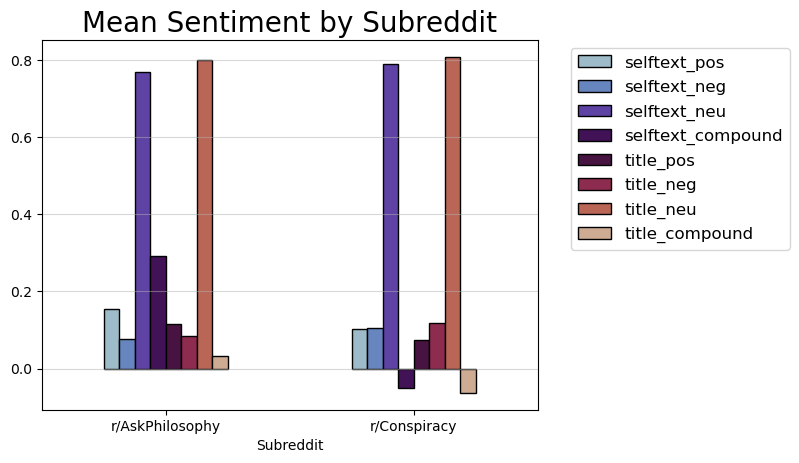
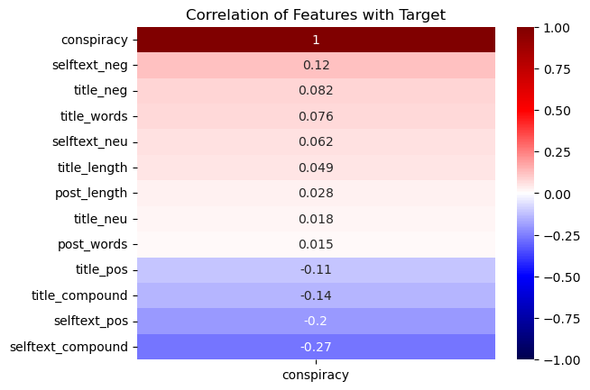
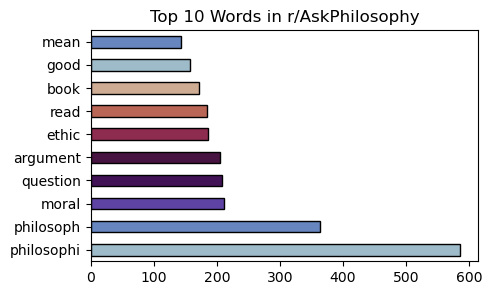
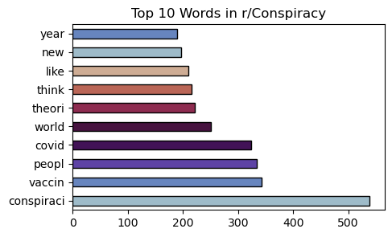
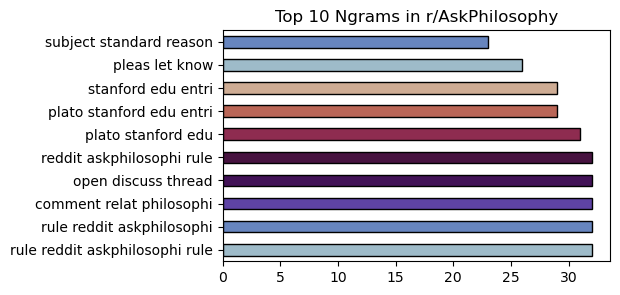
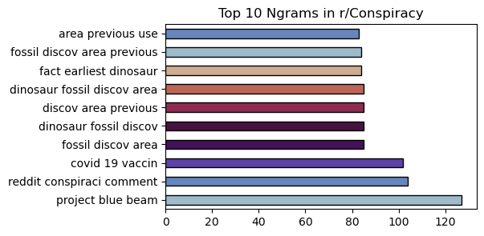
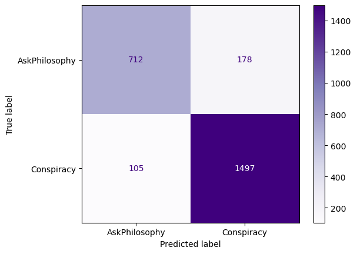
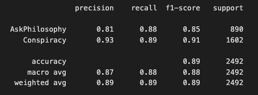

 

# Conspiracy or Philosophy?

### A data scientific study of online discourse via natural language analysis of subreddit communities

---

## Background

Personally, I’ve been a longtime user of the well-travelled “Front-page of the Internet” otherwise known as Reddit.com. My favorite thing about this website is the sheer volume of thoughts and opinions on any subject imaginable. During my undergraduate days as a philosophy major, I spent a fair amount of time on the **************************r/AskPhilosophy************************** *********subreddit*********, a place where folks can ask questions about the theory and practice of philosophy across time and schools of thought. I’ve often wondered if there was something unique about the type of discourse taking place here on the askphilosophy subreddit given the nature of the subject matter. Are theories given proper justification? What sort of attitudes are presented in the questions asked here? Most importantly, can this discourse be distinguished from mere speculation?

In answering these questions, I set out to test if machine learning algorithms focused on text analysis could determine whether a post belongs to r/AskPhilosophy or r/Conspiracy, using the latter subreddit as a stand in for such “mere speculation”. Of course, such an assumption is bound to be simplistic, so results should be taken with a grain of salt.

## Project Overview

This data science project aimed to classify new posts on Reddit as belonging either to **r/Conspiracy** or **r/AskPhilosophy** by analyzing the *3 & 4-gram* (sequences of 3 - 4 words) *frequencies* in post body text, as well as single word frequencies in post titles in each subreddit. I also conducted sentiment analyses on the aforementioned text data in the hopes of uncovering some insight about the types of attitudes represented in these subreddits. The goal was to determine whether there were significant differences in language use between the subreddits and whether a classification model could accurately predict where new posts belong.

For the project, I created and compared a slew of machine learning algorithms: a Support Vector Machine, AdaBoost and Gradient-Boosted Trees, a Random Forest, and a Multinomial Naive Bayes algorithm, to develop the best classification model available. The models were evaluated using accuracy, F1, recall, and precision.

Overall, the project successfully demonstrated large potential for using data science techniques to classify posts on Reddit based on their language.

The scope of the project was quite broad, as I merely focused on describing (quantitatively) the differences in language use between the two communities. I believe this could open the door for further, perhaps more focused/narrow analyses concerning online discourse and types of argumentative structures used to advocate for ideas online.

The project also holds potential value for moderators and researchers in these subreddits. By automatically classifying new posts, moderators can more easily identify off-topic or rule-violating posts. Researchers can use this approach to analyze language use trends, gaining insights into the communities participating in the subreddits.

The final model used is a Support Vector Machine using a sigmoid kernel implementation, a C (inverse-regularization) value of 11.22, and   $\gamma\ = 1/n\_features$ (using the `gamma = ‘auto'` parameter, equivalent to 1/4012 in our case).  

The overall accuracy of this model was roughly 90% with a 93% sensitivity to the Conspiracy class, the metric that pushed me to select this model over an equally strong Multinomial Naive Bayes model. The SVM also achieved a stellar AUC score of 0.93 and an F1-score of 89%.

Further research could explore the use of more advanced machine learning algorithms like neural networks or the inclusion of additional subreddits in a multi-class classification setting to make the task more difficult or the findings more insightful than I was able to generate here.

---

## Data Collection

Data was collected using the [Pushshift](https://github.com/pushshift/api), a free and open-source python API for [Reddit](http://reddit.com).  Text submissions were collected from those made to the r/Conspiracy and r/AskPhilosophy subreddits in the past year. While Pushshift gives users up to nearly 100 features for each post, I dropped all features except the post’s body text (called ********selftext********) and title text. I chose to do this because the narrow scope of the investigation concerns only the language used on each subreddit, not necessarily everything else that comes with a particular post. Luckily, this data came pretty clean, but it was necessary to filter out a large number of posts that were either removed or contained only references to external pages via links. Word counts and lengths were computed for both title and selftext before labelling the data and storing to a .csv file for processing.

---

## Natural Language Processing

Before I could move to the modeling phase, it was necessary to undertake some preprocessing of the raw text data to improve concision and reduce “noise” in the text.

Text noise comes in many forms, but *stopwords* (common words like “and” or “the” that carry little informational value) and infrequent words had to be removed. Additionally, I ended up removing words like “Wikipedia” and “https”, “www”, “com” since I wanted the model to focus more on the “meaning” of the text, or rather, structure understood through common word frequencies. Thus, artifacts of the web like these external references needed to be cleaned.

I then used lemmatizing and stemming to reduce words to their root form in order to improve the accuracy of the model. This was important because it allowed the machine learning algorithms to more easily recognize and group together words with similar meanings, even if they were different forms of the same word. For example, "run", "running", and "ran" would all be stemmed to "run", making it easier for the model to identify patterns in language use.

After this, the text data was transformed into a matrix of term frequencies via a ****************Count Vectorizer**************** which served as the input for machine learning algorithms.

To top things off, I created some sentiment analysis scores for the selftext and title features using the NLTK library. Though these features didn’t end up being very useful for the production model, they introduced some interesting points during exploratory analysis that made the investigation more fruitful overall.

## Exploratory Analysis

My exploration of the collected dataset revealed that the sentiment scores, post/title length and word counts were all roughly the same across classes.  r/Conspiracy posts did tend to have a more negative overtone, and r/Philosophy posts tended to score higher in ********compound******** (a composite for positive, neutral, and negativity scores), but these were marginal differences.

Furthermore, the aforementioned features held very little correlation with the target class.

Most interesting in the exploratory analysis were the word and n-gram counts (n=3, 4) for each subreddit.

 The top 1-grams are mostly what you'd expect. I find it both strikingly accurate and slightly comical that the second most common word in the conspiracy class is vaccine, with covid taking 4th place. It's as spot on as you could be.

Top 10 words in the philosophy class are all pretty standard, though it is interesting to note that moral/ethical philosophy is the most represented via these words (as opposed to other types like metaphysics, epistemology, etc.).

For the Ngrams, we see relatively uninteresting results in r/AskPhilosophy. Many of the most common strings of a few words are just related to subreddit rule queries and links to the omnipresent (at least in the philosophy world) Stanford Encyclopedia.

Results from r/Conspiracy are far more interesting. We see a lot of covid related n-grams, which is to be expected. However, I've never heard of project blue beam, which I'll now have to be checking out. I'm also intrigued at the high volume of dinosaur related n-grams, as I'm not sure what to make of that discussion, but it's definitely interesting.

Boiled down, I’ll present these findings, as well as some others, in a brief list:

1. The distributions of post length and word count are very similar across classes, but we do see that conspiracy is our majority class by a large margin.
2. One notable finding is that conspiracy has a higher concentration of posts with very few (0 to ~25) words.
3. The sentiment distributions are very similar across classes, but we do see that conspiracy has a higher concentration of negative and neutral sentiment scores.
4. The mean sentiment scores are also very similar across classes, but we do see that conspiracy has a higher concentration of neutral sentiment scores. r/Philosophy had a higher mean compound score.
5. The text lengths (character counts) are highly correlated with word counts. This is to be expected, as longer posts will have more words and therefore more characters. Because of this, I chose to drop the character count features in our models to avoid multicollinearity.

---

## Modeling

### Baseline

Predicting the majority class, r/Conspiracy, for all posts resulted in an accuracy of roughly 64%. Improvements to the accuracy are measured from this baseline.

### Scoring Guidelines

- For the purposes of this project, I used accuracy, precision, recall, and F1-scores to measure the predictive power and utility of our machine learning algorithms.
- Due to the nature of the problem, there isn't a large incentive to value one of these metrics over the others. For example, if we were trying to predict whether or not a patient had a heart attack, we would want to minimize the number of false negatives (i.e. predicting that a patient did not have a heart attack when they actually did).
- In this case, however, both false negatives and false positives have relatively little impact on the outcome of the problem. Therefore, we will use accuracy as our primary metric for evaluating the performance of our models.
- We will also use the ROC curve to visualize the tradeoff between the true positive rate and the false positive rate.
- Finally, in the case of a close tie, I chose to err towards choosing the model that is more sensitive to the majority class (i.e. the model that predicts more false positives). Allowing conspiracy and misinformation to pass for real philosophy is arguably (hah) a more serious problem than allowing real philosophy to be mislabeled as conspiracy or misinformation.

---

### Model 1: Support Vector Machine

The best SVM found after hyper-parameter tuning was a sigmoid kernel implementation with a C (inverse-regularization) value of 11.22 and   $\gamma\ = 1/n\_features$ (using the `gamma = ‘auto'` parameter, equivalent to 1/4012 in our case).

|  | Precision | Recall | F1-Score | Support |
| --- | --- | --- | --- | --- |
| AskPhilosophy |  0.87  | 0.80 | 0.83 | 890 |
| Conspiracy | 0.89 | 0.93 | 0.91 | 1602 |
|  |  |  |  |  |
| Accuracy |  |  | 0.89 | 2492 |
| Weighted Avg | 0.89 | 0.89 | 0.89 | 2492 |

The SVM model achieved an overall accuracy of 89%, which means that it correctly classified 89% of the posts in the test dataset.

Looking at the precision scores, we can see that the model correctly predicted r/AskPhilosophy posts 87% of the time, and r/Conspiracy posts 89% of the time.

For recall, the model correctly identified 80% of the r/AskPhilosophy posts, indicating that it was only right when predicting a post as belonging to "Ask Philosophy" 4/5 times. Understood from the opposite direction, the model has a false negative rate of 20% when predicting the r/AskPhilosophy class.

On the other hand, the model achieved a striking 93% recall on the r/Conspiracy posts. From this, we would say that the model is more sensitive to r/Conspiracy posts than r/AskPhilosophy posts.

Finally, the F1-scores are 83% for r/AskPhilosophy and 91% for r/Conspiracy.

In summary, the model seems to perform well, with high precision and recall scores for both subreddits, as well as an overall accuracy of 89%. The weighted average of precision and recall (F1-score) is also high for both classes, indicating that the model is performing well in terms of both precision and recall.

---

### Model 2: Multinomial Naive Bayes

This model has an overall accuracy of 89%, which is equal to the SVM model. The recall score is higher for AskPhilosophy, but lower for Conspiracy. The F1-scores are similar, with a slight edge to the NB model.

Both models achieve an overall F1-score of 0.89, which is a good score. Honestly, either one of these models would be a good choice for our final model.

### Production Model

For the final model, I've decided to use the SVM model. It has accuracy equal to the NB Model, but a higher recall score for Conspiracy, which is the class we want to be more sensitive to.

---

## Insights and Concluding Remarks

After analyzing online discourse in two different subreddits, r/AskPhilosophy and r/Conspiracy, through natural language processing and machine learning algorithms, it's clear that there are significant differences in the language used by these communities. The project successfully demonstrated the potential for using data science techniques to classify posts on Reddit based on their language, and the results have the potential to be useful for moderators and researchers in these subreddits. By identifying language use trends, moderators can more easily spot off-topic or rule-violating posts, while researchers can gain insights into the types of argumentative structures used to advocate for ideas online.

The project's final model, a Support Vector Machine using a sigmoid kernel implementation, had an overall accuracy of roughly 90% with a 93% sensitivity to the Conspiracy class, making it a promising tool for identifying posts that may warrant further scrutiny. However, it's worth noting that the project's scope was quite broad, and more focused analyses could be conducted in the future to delve deeper into online discourse and the types of attitudes represented in these subreddits.

Overall, this project demonstrates the power of natural language processing and machine learning in understanding online discourse, and it's exciting to consider the possibilities for future research in this area. Whether it's analyzing language use trends, identifying off-topic posts, or gaining insights into different communities and their argumentative structures, there's no doubt that data science techniques can provide valuable insights into the online world.
